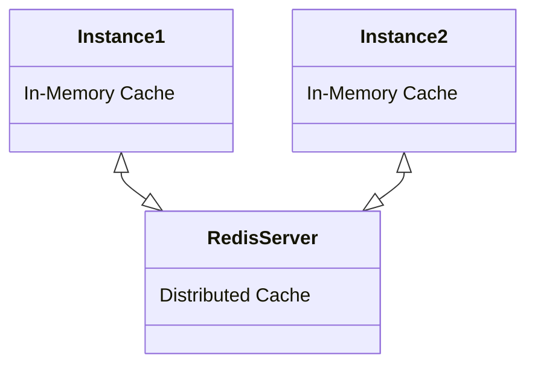

# Kafka with Spring Boot



## Install and Run Redis with Docker Compose

- Download and start service

```cmd
docker compose -f .\docker-compose.yml up -d
```

- Check Status `docker images`, `docker ps`
- Open integrated terminal within container

```cmd
docker exec -it redis-container /bin/sh
```

- Now within integrated terminal,

```cmd
redis-cli
```

- [_Hints_](https://chartio.com/resources/tutorials/how-to-get-all-keys-in-redis/) to use redis-cli for our purpose

- [Swagger](http://localhost:5000/swagger-ui/index.html#/) for this service
